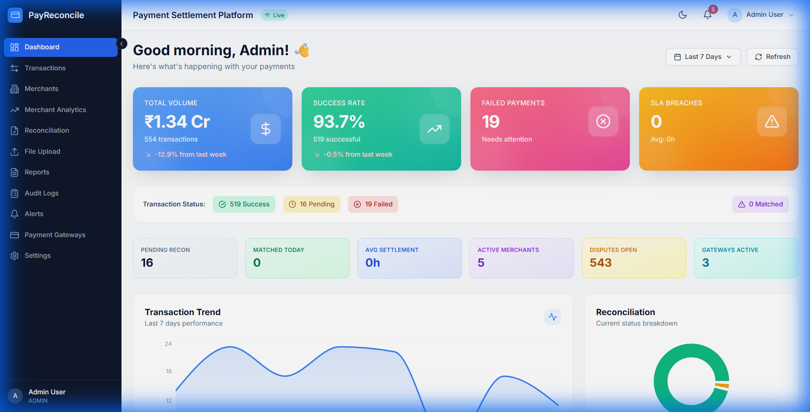
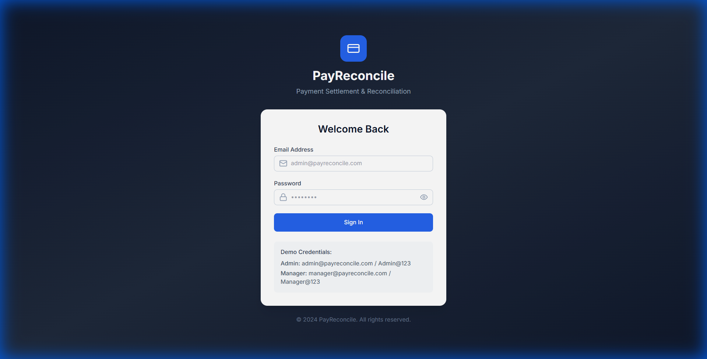
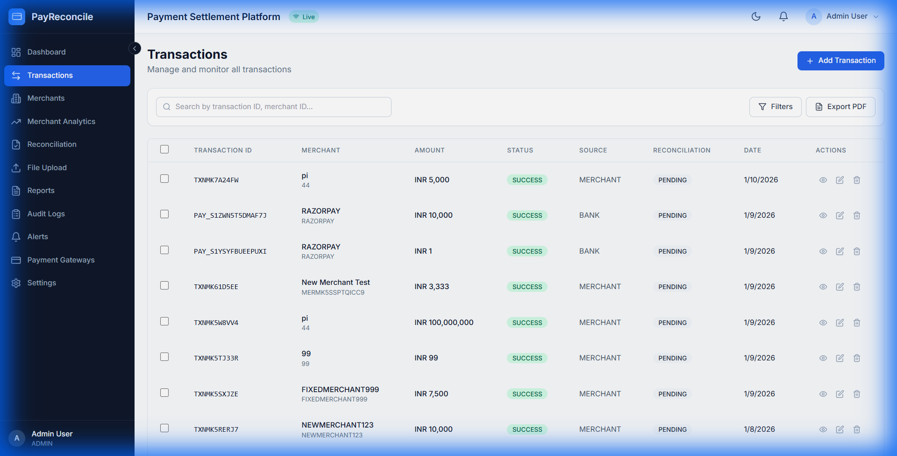
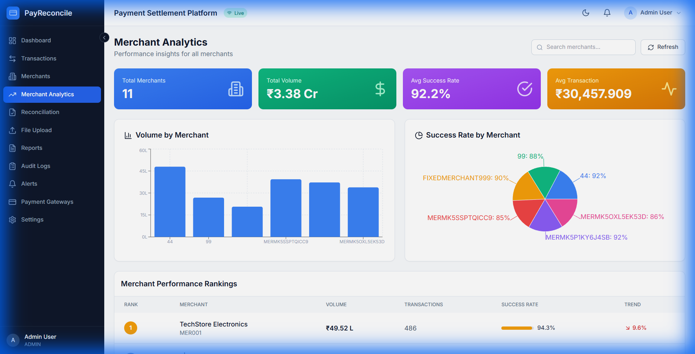
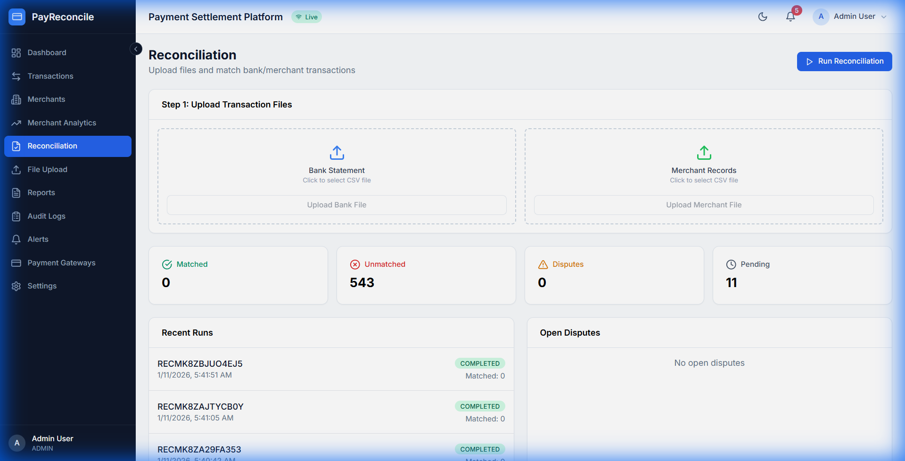
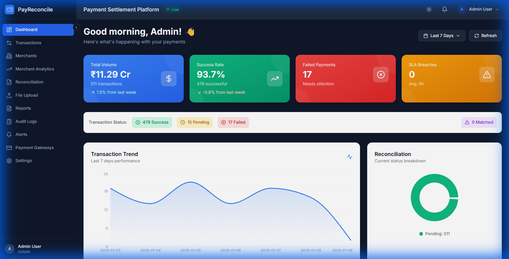

# PayReconcile - Payment Settlement & Reconciliation Platform

<p align="center">
  
</p>

A comprehensive enterprise-grade payment settlement and reconciliation platform built with **Node.js**, **React**, and **MongoDB**. Integrates with **Razorpay** and **Stripe** payment gateways for real-time transaction sync and automated reconciliation.

## ✨ Features

### 🔐 Authentication & Security
- JWT-based authentication with refresh tokens
- Role-based access control (Admin, Analyst, Viewer)
- Secure password hashing with bcrypt
- Session management with auto-logout

### 📊 Dashboard & Analytics
- Real-time transaction statistics
- Date range picker with presets (Today, 7d, 30d, 90d)
- Period-over-period comparison indicators
- Transaction trends visualization
- Reconciliation status breakdown

### 💳 Transaction Management
- Full CRUD operations for transactions
- Advanced search and filtering
- Quick filter presets (Today, This Week, Failed Only, etc.)
- Bulk status updates
- PDF report generation

### 🏢 Merchant Management
- Merchant onboarding and management
- Merchant performance analytics
- Volume and success rate tracking
- Merchant rankings by performance

### ⚖️ Automated Reconciliation
- Rule-based transaction matching
- Support for multiple matching strategies
- SLA breach detection and tracking
- Reconciliation run history

### 🔌 Payment Gateway Integrations
- **Razorpay** - Full API integration with webhook support
- **Stripe** - Payment sync and management
- Real-time transaction syncing
- Gateway performance comparison

### 🌙 User Experience
- Dark mode support with system preference detection
- Responsive design for all screen sizes
- Smooth animations with Framer Motion
- Toast notifications for actions

---

## 📸 Screenshots

### Login Page
<p align="center">
  
</p>

### Dashboard
<p align="center">
  
</p>

### Transactions
<p align="center">
  
</p>

### Merchant Analytics
<p align="center">
  
</p>

### Reconciliation
<p align="center">
  
</p>

### Dark Mode
<p align="center">
  
</p>

---

## 🛠️ Tech Stack

### Backend
- **Node.js** - Runtime
- **Express.js** - Web framework
- **MongoDB** - Database
- **Mongoose** - ODM
- **JWT** - Authentication
- **Razorpay SDK** - Payment integration
- **Stripe SDK** - Payment integration

### Frontend
- **React 18** - UI framework
- **Vite** - Build tool
- **Tailwind CSS** - Styling
- **Recharts** - Data visualization
- **Framer Motion** - Animations
- **Lucide React** - Icons
- **React Router** - Navigation
- **Axios** - HTTP client

---

## 🚀 Getting Started

### Prerequisites
- Node.js 18+
- MongoDB (local or Atlas)
- Razorpay/Stripe API keys (optional)

### Installation

1. **Clone the repository**
```bash
git clone https://github.com/yourusername/payreconcile.git
cd payreconcile
```

2. **Install Backend Dependencies**
```bash
cd backend
npm install
```

3. **Configure Environment Variables**
```bash
cp .env.example .env
# Edit .env with your configuration
```

Required environment variables:
```env
PORT=5000
MONGODB_URI=mongodb://localhost:27017/payreconcile
JWT_SECRET=your-secret-key
JWT_EXPIRES_IN=7d
RAZORPAY_KEY_ID=your-razorpay-key
RAZORPAY_KEY_SECRET=your-razorpay-secret
STRIPE_SECRET_KEY=your-stripe-key
```

4. **Install Frontend Dependencies**
```bash
cd ../frontend
npm install
```

5. **Start the Application**

Backend:
```bash
cd backend
npm run dev
```

Frontend:
```bash
cd frontend
npm run dev
```

6. **Access the Application**
- Frontend: http://localhost:5173
- Backend API: http://localhost:5000

### Default Login Credentials
```
Email: admin@payreconcile.com
Password: Admin@123
```

---

## 📁 Project Structure

```
payreconcile/
├── backend/
│   ├── config/          # Database & app configuration
│   ├── controllers/     # Request handlers
│   ├── middleware/      # Auth & validation middleware
│   ├── models/          # Mongoose schemas
│   ├── routes/          # API routes
│   ├── services/        # Business logic
│   └── utils/           # Helper utilities
├── frontend/
│   ├── src/
│   │   ├── components/  # Reusable UI components
│   │   ├── context/     # React context providers
│   │   ├── pages/       # Page components
│   │   ├── services/    # API service layer
│   │   └── utils/       # Helper functions
│   └── public/          # Static assets
└── screenshots/         # Documentation images
```

---

## 📝 API Endpoints

### Authentication
| Method | Endpoint | Description |
|--------|----------|-------------|
| POST | `/api/v1/auth/login` | User login |
| POST | `/api/v1/auth/refresh` | Refresh token |
| GET | `/api/v1/auth/me` | Get current user |

### Transactions
| Method | Endpoint | Description |
|--------|----------|-------------|
| GET | `/api/v1/transactions` | List transactions |
| POST | `/api/v1/transactions` | Create transaction |
| GET | `/api/v1/transactions/:id` | Get transaction |
| PUT | `/api/v1/transactions/:id` | Update transaction |
| DELETE | `/api/v1/transactions/:id` | Delete transaction |

### Merchants
| Method | Endpoint | Description |
|--------|----------|-------------|
| GET | `/api/v1/merchants` | List merchants |
| POST | `/api/v1/merchants` | Create merchant |
| GET | `/api/v1/merchants/:id` | Get merchant |
| PUT | `/api/v1/merchants/:id` | Update merchant |

### Reconciliation
| Method | Endpoint | Description |
|--------|----------|-------------|
| POST | `/api/v1/reconciliation/run` | Run reconciliation |
| GET | `/api/v1/reconciliation/dashboard` | Get stats |

### Dashboard
| Method | Endpoint | Description |
|--------|----------|-------------|
| GET | `/api/v1/dashboard/summary` | Get summary stats |
| GET | `/api/v1/dashboard/sla` | Get SLA metrics |

---

## 🔧 Configuration

### Payment Gateway Setup

**Razorpay:**
1. Create account at [Razorpay](https://razorpay.com)
2. Get API keys from Dashboard → Settings → API Keys
3. Add to `.env` file

**Stripe:**
1. Create account at [Stripe](https://stripe.com)
2. Get API keys from Dashboard → Developers → API Keys
3. Add to `.env` file

---

## 📄 License

This project is licensed under the MIT License.

---

## 🤝 Contributing

Contributions are welcome! Please feel free to submit a Pull Request.

1. Fork the project
2. Create your feature branch (`git checkout -b feature/AmazingFeature`)
3. Commit your changes (`git commit -m 'Add some AmazingFeature'`)
4. Push to the branch (`git push origin feature/AmazingFeature`)
5. Open a Pull Request

---

## 📧 Support

For support, email support@payreconcile.com or open an issue in the repository.

---

<p align="center">
  Made with ❤️ by PayReconcile Team
</p>
